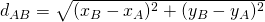

# A genetic algorithm for solving the Vehicle Routing Problem

This is a command-line interface program written in Python language for solving the VPR, minimizing the costs of it's routes.

## Input data format
	# This is a comment line
	
	params:
	  [param-name] [param-value]
	  ...
	
	nodes:
	  [node-label] [demand-value] [position-x] [position-y]
	  ...

Lines started with ```#``` are comments, then ignored by the program.

All the strings of the input are case-sensitive, except the labels ```params:``` and ```nodes:``` that are case-insensitive.

### Params

In ```params:``` block, it's defined the params for the VRP.

The unique and required accepted param is ```capacity```, that is a decimal positive number representing the capacity of the vehicle.

### Nodes

In ```nodes:``` block, it's defined the nodes of the VRP.

1. ```[node-label]``` is a label, terminated by a whitespace, to indentify that node;
2. ```[demand-value]``` is a decimal positive number that defines the demand value of the node;
3. ```[position-x]``` is the signed decimal value of the x-axis position in space of the node;
4. ```[position-y]``` is the signed decimal value of the y-axis position in space of the node.

The node of the depot is implicitly pré-defined, with ```depot``` label, demand ```0``` and position xy ```(0, 0)```.

#### Costs

The cost of the path from a node to another is calculated by the euclidian distance between them.

The formula below is the calculation of the distance between the nodes A and B:



## Output data format

	  route:
	depot
	first-visited-node
	another-node
	...
	depot
	  cost:
	[total-cost-value-of-the-routes]

In ```route:``` block, each line is the label of the visited node, in sequence.

## Running the program

```bash
python vrp.py [population-size] [number-of-iterations] < input-file.txt
```

Required params:

1. ```[population-size]``` is an integer positive number that specifies the number of individuals of each generation in the genetic algorithm;
2. ```[number-of-iterations]``` is an integer positive number that specifies the number of iterations (population generations) of the genetic algorithm.

Replace ```input-file.txt``` by the file from you want to read the input

### Example

Command to run:
```bash
python vrp.py 50 100 < in.txt
```

Input:

	# This is an example of data input
	
	params:
	  capacity 5
	
	nodes:
	  n1	2.3		-5	  7
	  n2	1.6		0	  -10.1
	  n3    0.98    -10   9
	  n4    1.1     5.78  0
	  n5    4.0     -5.78  0
	  n6    2.2     5.78  1.1
	  n7    1.1     5.78  -1.1
	  n8    0.1     0.1   0
	  n9    0.1     -0.1  0

Output:

	 route:
	depot
	n5
	n9
	depot
	n2
	n3
	n1
	depot
	n7
	n4
	n6
	n8
	depot
	 cost:
	71.176217

## Random input generator

This project also has an input VRP random sample generator.

```bash
python vrp-sample-gen.py [nodes-count] [capacity] [min-x] [max-x] [min-y] [max-y] > my-generated-vrp-input.txt
```

The program generates a formatted VRP input, with ```[nodes-count]``` nodes (not including the depot). With the capacity ```[capacity]```. Each node is choosen a random demand between ```0.0``` and ```[capacity]```; a random x-axis position between ```[min-x]``` and ```[max-x]```; and a random y-axis position between ```[min-y]``` and ```[max-y]```.

### Example

Command to run:
```bash
python vrp-sample-gen.py 10 45.89 -9.1 10 -7.63 8.05
```

Output:

	params:
	  capacity 45.890000
	nodes:
	  node01		17.511		9.194		1.066
	  node02		12.335		1.134		-1.621
	  node03		16.793		-6.862		-6.416
	  node04		18.821		-6.452		-2.332
	  node05		3.103		-5.402		-4.644
	  node06		39.410		6.795		-4.982
	  node07		33.389		6.707		0.483
	  node08		45.697		-7.255		4.209
	  node09		19.172		3.970		3.618
	  node10		4.366		-2.550		2.892

### Piping the generated input to the VRP program

You also can run the sample input generator then pass it directly to the VRP program to run.

```bash
python vrp-sample-gen.py [params...] | python vrp.py [params...]
```

Example:
```bash
python vrp-sample-gen.py 10 45.89 -9.1 10 -7.63 8.05 | python vrp.py 40 100
```
Output:

	 route:
	depot
	node06
	node05
	depot
	node07
	depot
	node02
	depot
	node01
	depot
	node03
	depot
	node08
	depot
	node04
	depot
	node09
	node10
	depot
	 cost:
	112.169544

## Glossary

**VRP** - Vehicle Routing Problem